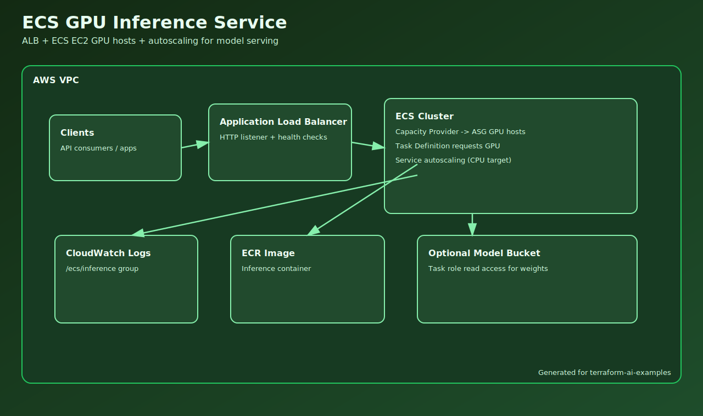

# ECS GPU Inference Service

## Problem It Solves

Serve GPU-based inference workloads with full control over runtime, networking, and scaling behavior.

## Why Teams Use It

- Need custom container/runtime behavior.
- Want predictable host-level tuning.
- Need VPC-native integration with internal systems.

## Primary Tradeoffs

- Higher operations overhead than fully managed endpoints.
- Significant cost exposure if ASG/task limits are too high.

## Source

- Terraform: `examples/ai/ecs-gpu-inference-service`
- Incident runbook: [ECS GPU Incident](../incidents/ai-ecs-gpu-inference-service.md)

## Validation Focus

- ALB health checks
- Task placement on GPU hosts
- Service and host autoscaling boundaries
