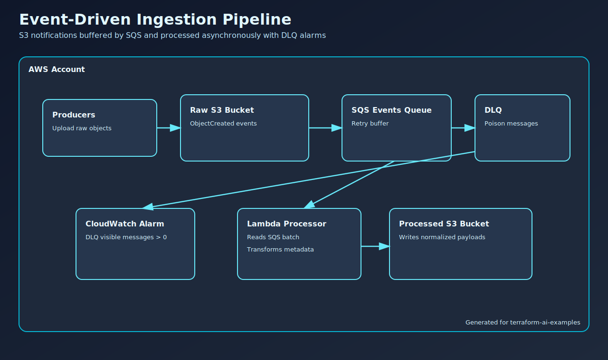

# Event-Driven Ingestion Pipeline

## Problem It Solves

Handle bursty file/event ingestion safely by decoupling producers from processing.

## Why Teams Use It

- Producers are spiky and asynchronous.
- Processing can fail transiently or permanently.
- Ops teams need DLQ signals and clear recovery paths.

## Primary Tradeoffs

- More moving parts than direct synchronous processing.
- Need strong idempotency and replay handling in processors.

## Source

- Terraform: `examples/data/event-driven-ingestion-pipeline`
- Incident runbook: [Ingestion Pipeline Incident](../incidents/data-event-driven-ingestion-pipeline.md)

## Validation Focus

- Raw-to-processed object flow
- DLQ and alarm behavior
- Retry safety under transient failures
