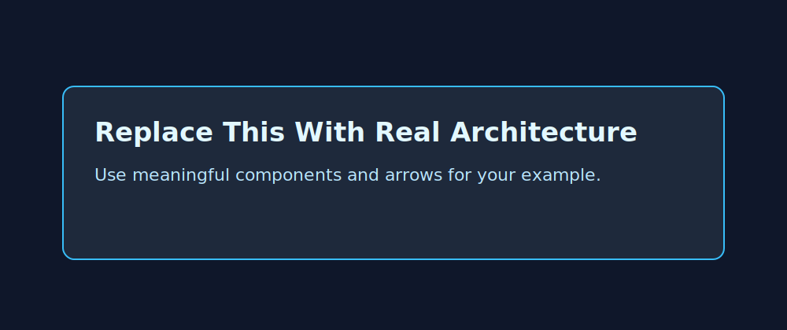

# Example Title

Short one-line summary of what this stack solves.

## Architecture



## What You'll Learn

- Learning objective 1
- Learning objective 2
- Learning objective 3

## Real-World Use Case

Describe where this pattern is used in production and why teams choose it.

## Usage

```bash
cp terraform.tfvars.example terraform.tfvars
terraform init
terraform plan
terraform apply
```

## Validation Steps

1. Step to verify resource behavior
2. Step to verify outputs
3. Step to verify expected failure handling

## System Design Sizing

- Assumption 1:
- Assumption 2:
- Capacity formula:
- Backlog/latency/storage formula:

## Incident Simulation

- Runbook: `../../docs/incidents/<domain>-<example-name>.md`

## Cost and Safety

- Expected cost range:
- Most expensive resource:
- Guardrail in this example:

## Cleanup

```bash
terraform destroy
```

## Next Improvements

- Hardening idea 1
- Hardening idea 2
