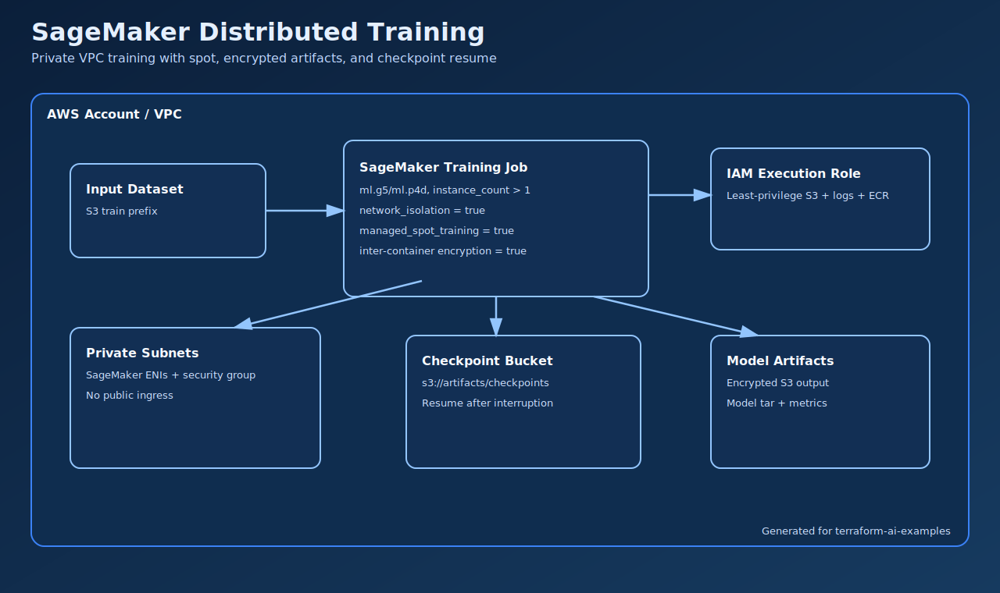

# SageMaker Distributed GPU Training

Define a reusable SageMaker training pipeline for multi-node GPU fine-tuning with private networking, spot support, and checkpoint recovery.

## Architecture



## What You'll Learn

- How to provision a SageMaker training pipeline with Terraform.
- How to reduce training cost using managed spot + checkpointing.
- How to isolate training workloads in private subnets with restricted IAM.

## Real-World Use Case

Used by ML platform teams running recurring fine-tuning jobs where cost and reliability both matter. The pipeline definition is versioned in Git, while execution is triggered intentionally for each training run.

## Usage

```bash
cp terraform.tfvars.example terraform.tfvars
terraform init
terraform plan
terraform apply
```

Then trigger a training run explicitly:

```bash
$(terraform output -raw start_execution_command)
```

## Validation Steps

1. Confirm role, artifact bucket, and pipeline outputs:

```bash
terraform output sagemaker_execution_role_arn
terraform output artifact_bucket_name
terraform output pipeline_name
```

2. Start one pipeline execution and capture the execution ARN:

```bash
$(terraform output -raw start_execution_command)
```

3. Verify execution status and check output/checkpoint objects in the artifact bucket.

## System Design Sizing

Assume:
- `instance_type = ml.p4d.24xlarge`
- `instance_count = 2`
- one training run takes 6 hours
- managed spot is enabled

Training capacity math:
- instance-hours per run = `instance_count * run_hours` = `2 * 6` = `12 instance-hours`
- if weekly retraining: monthly instance-hours ~= `12 * 4` = `48 instance-hours`

Cost-intuition math (before exact pricing checks):
- monthly compute ~= `effective_hourly_rate * instance_count * monthly_training_hours`
- if on-demand hourly were `H`, spot-effective at ~35% is `0.35 * H`

Schedule/SLO sizing:
- if model refresh SLO is 24h and one run is 6h, max retries before SLO breach ~= `floor(24/6) - 1 = 3`
- checkpoint interval target should keep lost work under 10 min per interruption

Operational headroom:
- keep `max_wait_seconds` well above expected runtime when using spot
- keep artifact/checkpoint bucket lifecycle and monitoring aligned with retraining frequency

## Incident Simulation

- Runbook: `../../../docs/incidents/ai-sagemaker-distributed-training.md`

## Cost and Safety

- Estimated cost risk: very high (GPU training instances dominate cost).
- Most expensive knobs: `instance_type`, `instance_count`, and runtime limits.
- Built-in guardrails: execution is explicit (not auto-run on apply), managed spot option, runtime/max-wait controls.

## Cleanup

```bash
terraform destroy
```

If you kept artifacts intentionally, empty the bucket manually only when you are done with checkpoints/model outputs.

## Next Improvements

- Add CloudWatch alarms for failed or prolonged pipeline executions.
- Add experiment tracking integration (for example, MLflow/W&B metadata sidecar).
- Add per-team quota controls for instance families.
