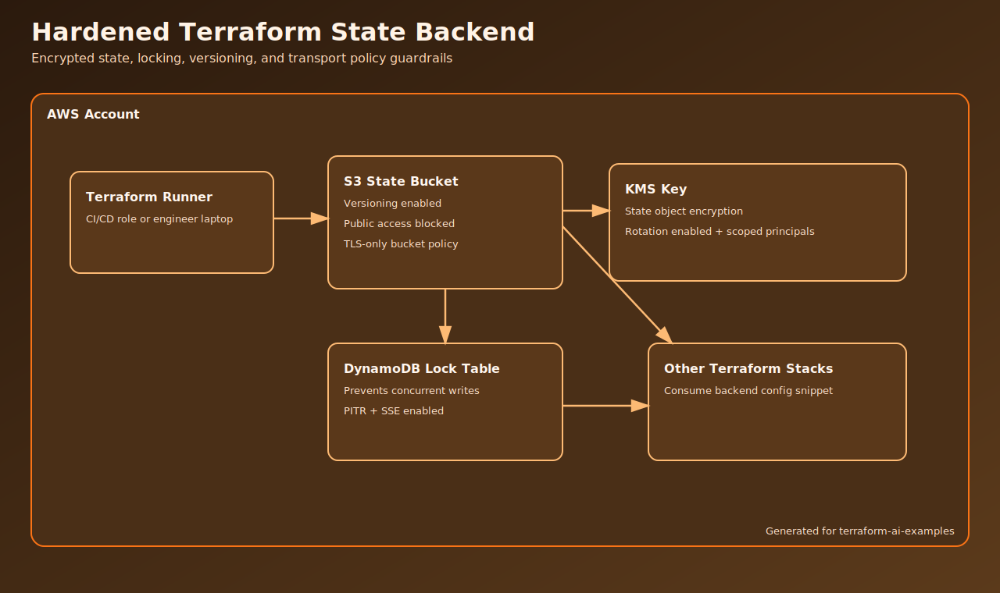

# Hardened Terraform State Backend

This example creates a secure remote backend with:
- versioned S3 state bucket
- DynamoDB locking table
- KMS encryption with rotation
- TLS-only S3 bucket policy

## Architecture



## Why This Is Useful

Remote state hardening is the first thing most teams miss. This baseline is designed for real use in multi-env pipelines.

## Usage

```bash
cp terraform.tfvars.example terraform.tfvars
terraform init
terraform apply
```

Use the `backend_hcl_snippet` output in downstream stacks.

## Notes

- Keep `force_destroy = false` for non-ephemeral environments.
- Restrict `state_key_arn_principals` to CI/CD roles only.
