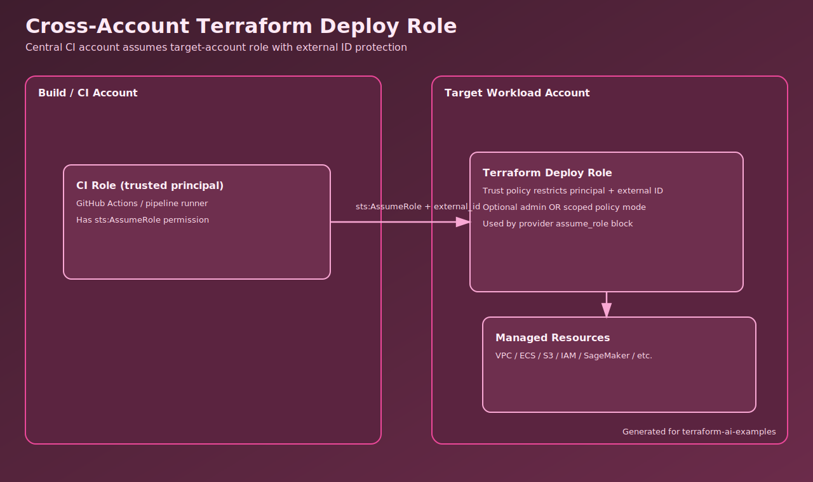

# Cross-Account Terraform Deploy Role

Provision a target-account IAM role that centralized CI/CD can assume safely for Terraform deployments.

## Architecture



## What You'll Learn

- How to structure cross-account Terraform trust relationships.
- How to enforce `external_id` and strict trusted principals.
- How to choose between broad admin and scoped policy modes.

## Real-World Use Case

Common in organizations with centralized CI but isolated workload accounts. This approach lets platform teams govern deployment access while keeping account boundaries clear.

## Usage

```bash
cp terraform.tfvars.example terraform.tfvars
terraform init
terraform plan
terraform apply
```

## Validation Steps

1. Confirm role output:

```bash
terraform output deploy_role_arn
```

2. Review generated provider assume-role snippet:

```bash
terraform output assume_role_snippet
```

3. From the trusted account, call STS assume-role with the correct external ID and confirm access works.

## Incident Simulation

- Runbook: `../../../docs/incidents/security-cross-account-terraform-deploy-role.md`

## Cost and Safety

- Estimated cost risk: low (IAM-only pattern).
- Main risk is security misconfiguration, not infrastructure spend.
- Built-in guardrails: explicit trusted principals, mandatory external ID, optional scoped policy mode.

## Cleanup

```bash
terraform destroy
```

## Next Improvements

- Add policy boundaries and session tag enforcement.
- Add CloudTrail detection for unexpected assume-role attempts.
- Restrict scoped actions further by resource ARNs per environment.
